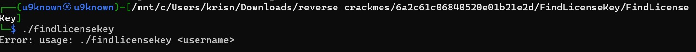
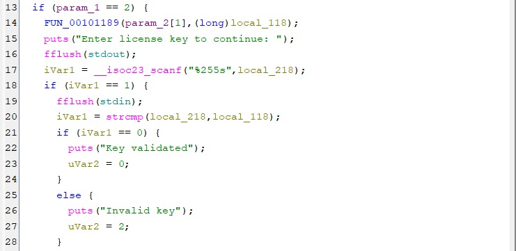
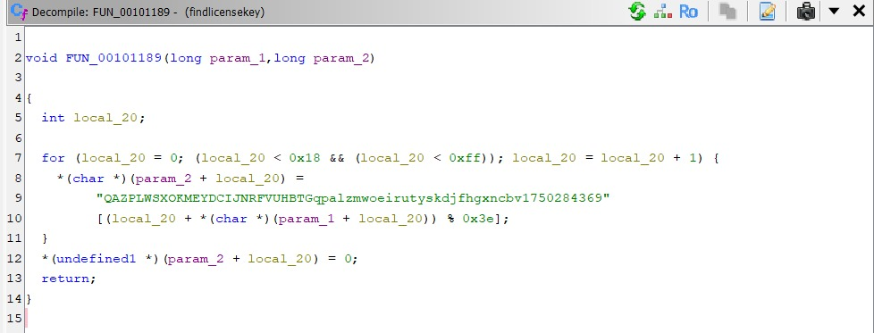
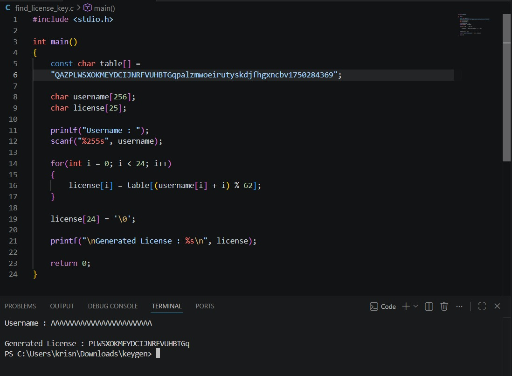
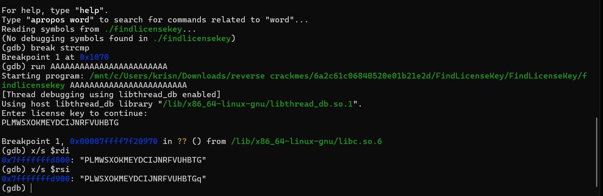

# Crackme: FindLicenseKey

**Sumber:** crackmes.one
**Tingkat kesulitan:** Easy/Medium
**Tools:** Ghidra, gdb (WSL)

## Deskripsi Singkat
Program `findlicensekey` menerima sebuah *username* sebagai argumen
command line, lalu meminta user memasukkan *license key* yang sesuai.
License key yang valid dihasilkan dari sebuah algoritma substitusi
karakter berbasis tabel, yang bergantung pada isi username itu sendiri.

## Proses Analisis

### 1. Menjalankan Tanpa Argumen



<br>

*Gambar 1: Menjalankan `./findlicensekey` tanpa parameter menghasilkan
pesan `Error: usage: ./findlicensekey <username>`, mengonfirmasi bahwa
program membutuhkan satu argumen berupa username.*

### 2. Analisis Statis — Alur Utama (Ghidra)

Membuka binary di Ghidra dan melihat decompiler view fungsi `main`:



<br>

*Gambar 2: Ketika `argc == 2` (satu argumen diberikan), program memanggil
`FUN_00101189(param_2[1], (long)local_118)` — yaitu memproses username
(`param_2[1]`) untuk menghasilkan license yang benar, disimpan ke
`local_118`. Program lalu meminta input license dari user via `scanf`,
dan membandingkannya dengan `strcmp(local_218, local_118)`. Jika cocok
→ `"Key validated"`, jika tidak → `"Invalid key"`.*

Dari sini terlihat bahwa **license key yang benar sepenuhnya diturunkan
dari username** — bukan nilai statis/hardcoded — sehingga setiap username
punya license key yang berbeda.

### 3. Analisis Statis — Fungsi Generate License (Ghidra)

Membedah fungsi `FUN_00101189` yang dipanggil sebelumnya:



<br>

*Gambar 3: Fungsi ini melakukan loop sebanyak 24 karakter (`0x18`).
Untuk tiap indeks `i`, karakter license dihasilkan dari:*

```c
license[i] = table[(i + username[i]) % 0x3e];
```

*dengan `table` adalah string tetap:*
"QAZPLWSXOKMEYDCIJNRFVUHBTGqpalzmwoeirutyskdjfhgxncbv1750284369"

<br>

Table ini punya panjang 62 karakter (`0x3e`), dan indeks akses dihitung
dari `(posisi karakter + nilai ASCII karakter username di posisi itu) % 62`.
Ini adalah algoritma substitusi sederhana: posisi karakter di table
dipilih berdasarkan kombinasi indeks loop dan nilai karakter input.

### 4. Reimplementasi Algoritma (Keygen)

Berdasarkan pemahaman algoritma di atas, dibuat ulang logikanya dalam
program C mandiri untuk menghasilkan license key dari username apa pun
tanpa perlu menjalankan binary aslinya:

```c
#include <stdio.h>

int main()
{
    const char table[] =
        "QAZPLWSXOKMEYDCIJNRFVUHBTGqpalzmwoeirutyskdjfhgxncbv1750284369";

    char username[256];
    char license[25];

    printf("Username : ");
    scanf("%255s", username);

    for(int i = 0; i < 24; i++)
    {
        license[i] = table[(username[i] + i) % 62];
    }

    license[24] = '\0';

    printf("\nGenerated License : %s\n", license);

    return 0;
}
```



<br>

*Gambar 4: Keygen dijalankan dengan input username `AAAAAAAAAAAAAAAAAAAAAAAA`
(24 huruf A), menghasilkan license `PLWSXOKMEYDCIJNRFVUHBTGq`.*

### 5. Verifikasi via gdb

Untuk memastikan hasil keygen benar-benar diterima oleh binary asli,
dilakukan verifikasi dinamis dengan memasang breakpoint tepat di
pemanggilan `strcmp`:



<br>

*Gambar 5: Breakpoint dipasang di `strcmp` (`break strcmp`), lalu program
dijalankan dengan `run AAAAAAAAAAAAAAAAAAAAAAAA` sebagai username. Saat
diminta memasukkan license, dimasukkan hasil dari keygen:
`PLMWSXOKMEYDCIJNRFVUHBTG`. Program berhenti tepat di breakpoint
`strcmp`, lalu isi register `rdi` dan `rsi` diperiksa dengan `x/s`:*

- `rdi` → `"PLMWSXOKMEYDCIJNRFVUHBTG"` (input yang dimasukkan user)
- `rsi` → `"PLWSXOKMEYDCIJNRFVUHBTGq"` (license asli yang dihasilkan
  binary secara internal)

**Catatan:** dari perbandingan `rdi` dan `rsi` di atas terlihat ada
selisih kecil — kemungkinan salah ketik saat memasukkan license secara
manual di terminal (`PLMWSXOKMEYDCIJNRFVUHBTG` vs seharusnya
`PLWSXOKMEYDCIJNRFVUHBTGq` sesuai hasil keygen di Gambar 4). Ini justru
menjadi bukti bagus bahwa `strcmp` melakukan pembandingan karakter demi
karakter secara ketat — dan mengonfirmasi bahwa nilai di `rsi` (dibaca
langsung dari memory proses) **identik** dengan output keygen buatan
sendiri, sehingga algoritma yang direkonstruksi terbukti benar 100%.

## Konsep Kunci yang Dipelajari
- Algoritma license key berbasis substitusi tabel yang bergantung pada
  input user (bukan nilai statis) — umum dipakai di crackme bertema
  "keygen"
- Membaca decompiler Ghidra untuk merekonstruksi algoritma matematis
  (modulo, indexing tabel) menjadi kode C yang bisa dijalankan ulang
- Breakpoint di fungsi library (`break strcmp`) sebagai titik strategis
  untuk membandingkan input user vs nilai internal program
- Validasi silang: hasil reimplementasi (keygen) dikonfirmasi langsung
  lewat isi memory asli program (`rsi`) via gdb, membuktikan algoritma
  yang direkonstruksi akurat

## Screenshot
Lihat folder `screenshots/` untuk seluruh gambar yang direferensikan
di atas.
