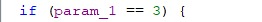
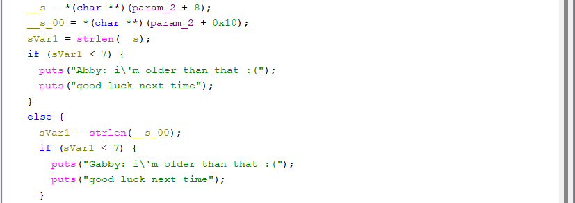
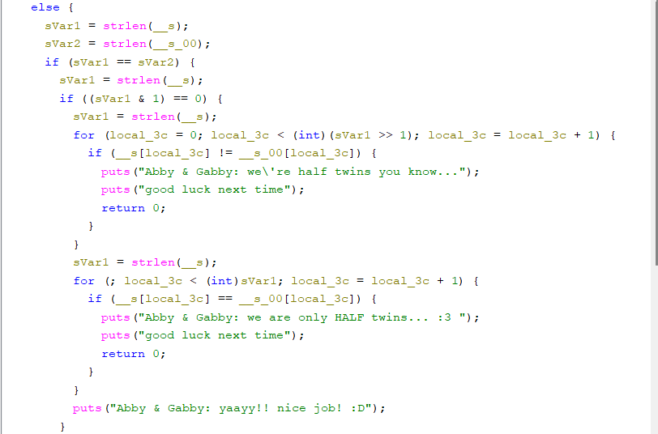

# Crackme: halftwin

**Sumber:** crackmes.one
**Tingkat kesulitan:** Easy/Medium
**Tools:** Ghidra, gdb (WSL)

## Deskripsi Singkat
Program `halftwin` menerima satu argumen berupa string dari command line,
lalu memvalidasi string tersebut lewat beberapa tahap pengecekan sebelum
menyatakan input valid atau tidak.

## Proses Analisis

### 1. Pengecekan Jumlah Argumen
Saat program dibuka di Ghidra, terlihat validasi awal memeriksa jumlah
argumen yang diberikan (`argc`). Jika jumlah argumen tidak sesuai
(misalnya program dijalankan tanpa parameter), program langsung
menampilkan pesan error dan keluar.

### 2. Pengecekan Panjang String
Setelah argumen tervalidasi, program mengecek panjang string input.
Panjang string ini juga harus memenuhi syarat genap, yang dideteksi
lewat operasi bitwise:

```c
if (length & 1) {
    // ganjil -> gagal
}
```

Operasi `& 1` ini pada dasarnya mengambil bit paling akhir (LSB) dari
sebuah angka. Kalau bit itu `1`, angkanya ganjil; kalau `0`, berarti genap.
Ini trik umum di reverse engineering karena lebih cepat dibanding operasi
modulo (`% 2`).

### 3. Pembagian String Jadi Dua Bagian
Karena panjang string harus genap, program lalu membagi string tersebut
jadi dua bagian sama besar menggunakan operasi `>> 1` (bitwise shift
kanan), yang secara efektif membagi angka dengan 2:

```c
half = length >> 1;
```

### 4. Loop Perbandingan
Ditemukan dua loop berbeda di fungsi validasi:
- Loop pertama membandingkan karakter-karakter di separuh pertama string
  dengan pola/nilai tertentu.
- Loop kedua membandingkan separuh kedua string dengan hasil transformasi
  dari separuh pertama.

Dengan menelusuri kedua loop ini di Ghidra (decompiler view) dan
mengonfirmasi lewat gdb (memasang breakpoint di titik pembanding, lalu
memeriksa isi register/memory saat program berjalan), didapatkan pola
hubungan antara separuh pertama dan separuh kedua string yang harus
dipenuhi agar validasi lolos.

### 5. Menyusun Input Valid
Berdasarkan pola tersebut, disusun string dengan panjang genap yang
memenuhi kedua syarat loop di atas. Setelah dicoba menjalankan
`./halftwin <input>` dengan string hasil analisis, program menampilkan
pesan sukses/valid.

## Konsep Kunci yang Dipelajari
- `& 1` → cek genap/ganjil (ambil bit terakhir)
- `>> 1` → pembagian cepat dengan 2 (geser bit ke kanan)
- Cara membaca representasi variabel hasil dekompilasi Ghidra
  (misalnya `local_3c`, penamaan berbasis offset stack)
- Pentingnya validasi dinamis (gdb) untuk mengonfirmasi asumsi dari
  analisis statis (Ghidra)

## Screenshot

\n


ternyata halftwin ini memerlukan 3 argumen untuk bisa di run
(./halftwin jhadjaw audiagd)





disini terjadi pengecekan panjang Input Abby (__s), Gabby (__s_00).
Jika panjang Input ke-1 (Abby) < 7 maka akan keluar Output 'Abby: i\'m older than that :('
dan begitu juga dengan panjang Input ke-2 (Gabby), 
jika panjang Input ke-1 dan ke-2 > 7 tapi ganjil maka akan keluar Output 'Abby & Gabby: we are not \"odd\" years old :('.





Pada Loop pertama terlihat sVar1 >> 1 artinya, geser 1 bit ke kanan sama efeknya kayak bagi 2 (dan buang sisa/pembulatan ke bawah),
selanjutnya __for (local_3c = 0; local_3c < (int)(sVar1 >> 1); local_3c = local_3c + 1)_ artinya ini loop dari index 0 - setengah panjang total string
kalau len = 8 loop akan jalan _local_3c = 0, 1, 2, 3_.
Lalu ada juga _if (__s[local_3c] != __s_00[local_3c])_ artinya pada loop pertama ini semua karakter arg1 dan arg2 harus 100% identik.


Pada Loop kedua terlihat for _(; local_3c < (int)sVar1; local_3c = local_3c + 1)_ local_3c nggak di-reset ke 0.
Karena local_3c itu variabel yang sama dari loop pertama,
dan loop pertama berhenti pas local_3c == len/2, maka loop kedua ini lanjut dari situ (len/2) sampai len (akhir string).
Jadi loop kedua ini nyisir setengah kedua string (index len/2 sampai len-1).
selanjutnya _if (__s[local_3c] == __s_00[local_3c])_ ini juga gagal karena mereka (Abby, Gabby) hanya halftwin.
Jadi Loop pertama semua karakter harus 100% identik, dan di Loop kedua semua karakter harus 100% berbeda.

