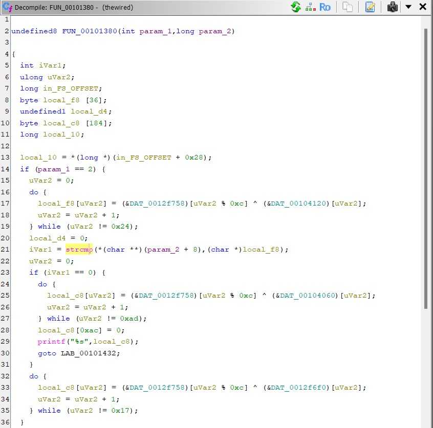
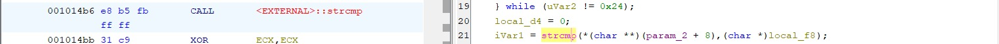
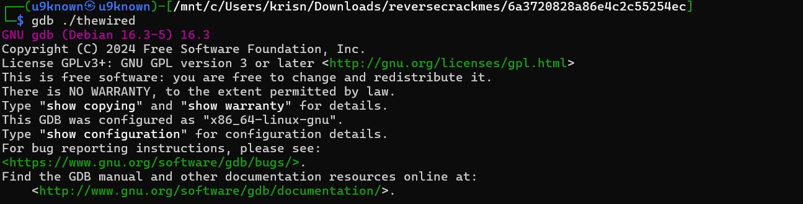
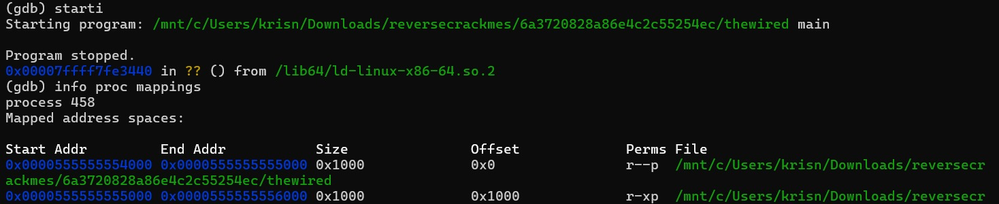
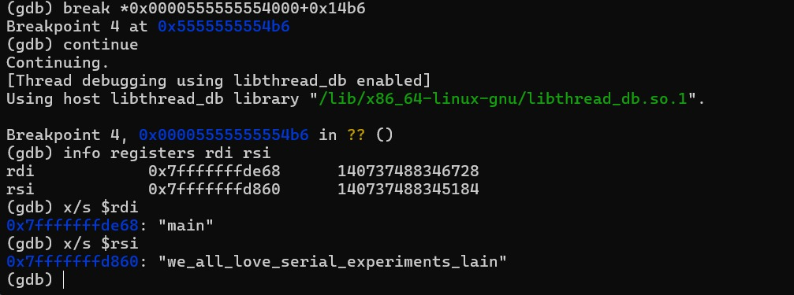
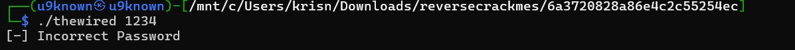
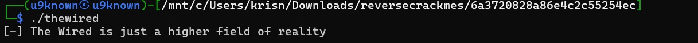

# Crackme: the wired

**Sumber:** crackmes.one
**Tingkat kesulitan:** Easy/Medium
**Tools:** Ghidra, gdb (WSL)

## Deskripsi Singkat
Program `thewired` menerima satu argumen command line (password) dan
memvalidasinya terhadap sebuah string yang disembunyikan (obfuscated)
menggunakan operasi XOR di dalam binary.

## Proses Analisis

### 1. Analisis Statis dengan Ghidra

Membuka binary di Ghidra dan melihat fungsi utama lewat decompiler view.
Ditemukan struktur berikut:

```c
if (param_1 == 2) {
    // decode buffer local_f8 (36 byte) via XOR
    uVar2 = 0;
    do {
        local_f8[uVar2] = (&DAT_0012f758)[uVar2 % 0xc] ^ (&DAT_00104120)[uVar2];
        uVar2 = uVar2 + 1;
    } while (uVar2 != 0x24);

    iVar1 = strcmp(*(char **)(param_2 + 8), (char *)local_f8);

    if (iVar1 == 0) {
        // decode & print pesan sukses (173 byte)
    } else {
        // decode & print "[-] Incorrect Password" (23 byte)
    }
}
```



<br>

*Gambar 1: Fungsi utama mengecek `argc == 2`, lalu mendekode buffer 36-byte
menggunakan XOR antara dua tabel data (`DAT_0012f758` yang berulang tiap
12 byte, di-XOR dengan `DAT_00104120`), sebelum dibandingkan dengan
`strcmp` terhadap argumen yang diberikan user.*

Pola XOR ini adalah teknik obfuscation umum: string asli (password)
tidak disimpan mentah di binary, melainkan hasil XOR-nya saja. String asli
baru terbentuk saat program dijalankan (runtime), sehingga tidak langsung
terlihat kalau cuma di-`strings`.

Titik krusial ada di baris pemanggilan `strcmp`, terlihat di assembly:



<br>

*Gambar 2: Instruksi `CALL <EXTERNAL>::strcmp` di alamat `001014b6`
menjadi titik target breakpoint untuk analisis dinamis, karena di titik
inilah kedua buffer (input user dan password asli hasil decode) sudah
siap dibandingkan.*

### 2. Analisis Dinamis dengan gdb

Alih-alih menelusuri manual logika XOR (yang butuh replikasi tabel data
satu per satu), dipilih pendekatan lebih cepat: **membaca buffer password
asli langsung dari memory saat runtime**, tepat sebelum `strcmp`
dieksekusi.



<br>

*Gambar 3: Memuat binary `thewired` ke dalam gdb.*



<br>

*Gambar 4: Program dijalankan dengan `starti` (stop di instruksi pertama),
lalu `info proc mappings` digunakan untuk mengonfirmasi base address
proses (`0x0000555555554000`), yang dibutuhkan untuk menghitung alamat
absolut breakpoint dari offset relatif di Ghidra (`0x14b6`).*

Alamat breakpoint dihitung dengan menjumlahkan base address dengan offset
dari Ghidra:
0x0000555555554000 + 0x14b6 = 0x5555555554b6

<br>



<br>

*Gambar 5: Breakpoint dipasang tepat di alamat `CALL strcmp`
(`break *0x0000555555554000+0x14b6`). Setelah program di-`continue`
sampai breakpoint tercapai, register `rdi` dan `rsi` diperiksa dengan
`info registers` — keduanya berisi alamat memory dari dua string yang
akan dibandingkan `strcmp`. Dengan perintah `x/s $rdi` dan `x/s $rsi`,
isi string tersebut dibaca langsung:*

- `rdi` → `"main"` (argumen yang diberikan user saat menjalankan program)
- `rsi` → `"we_all_love_serial_experiments_lain"` (password asli hasil
  decode XOR, terbaca langsung dari memory tanpa perlu decode manual)

**Ini adalah aha moment utama**: daripada menghitung ulang XOR dari dua
tabel data secara manual (rawan salah hitung), cukup pasang breakpoint
tepat sebelum perbandingan terjadi, lalu baca isi buffer yang sudah
di-decode oleh program itu sendiri.

### 3. Verifikasi Password

Percobaan dengan password sembarang menghasilkan pesan gagal:



<br>

*Gambar 6: `./thewired 1234` menghasilkan `[-] Incorrect Password`,
mengonfirmasi bahwa string `"1234"` tidak cocok dengan hasil decode.*



<br>

*Gambar 7: Menjalankan `./thewired` tanpa argumen (sehingga `argc` tidak
sama dengan 2) menampilkan teks flavor `"The Wired is just a higher
field of reality"`, bukan pesan error — mengonfirmasi bahwa cabang
`if (param_1 == 2)` di Ghidra memang hanya dieksekusi ketika ada
tepat satu argumen tambahan.*

## Konsep Kunci yang Dipelajari
- Obfuscation string via XOR runtime: string asli tidak pernah disimpan
  mentah di binary, sehingga tidak terlihat dengan `strings` biasa
- Menghitung alamat breakpoint absolut dari offset relatif Ghidra +
  base address proses (`info proc mappings`)
- Membaca isi memory langsung lewat register (`info registers`,
  `x/s $reg`) sebagai cara cepat mem-bypass reverse-engineering manual
  terhadap algoritma decode
- Breakpoint strategis: menempatkan breakpoint tepat sebelum instruksi
  perbandingan (`strcmp`) adalah teknik umum untuk "mencuri" hasil
  decode tanpa perlu memahami algoritmanya secara utuh

## Screenshot
Lihat folder `screenshots/` untuk seluruh gambar yang direferensikan
di atas.
